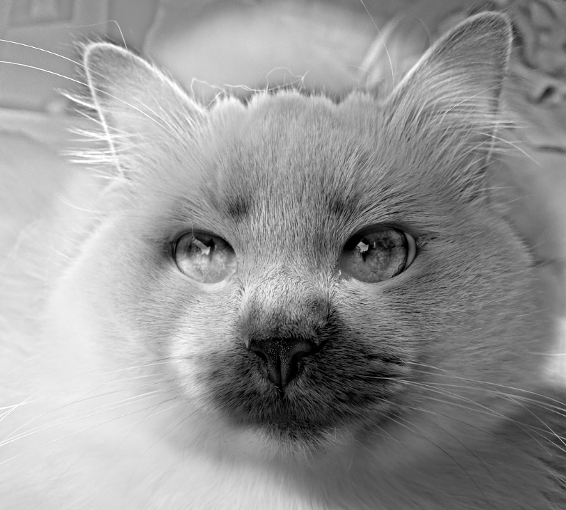
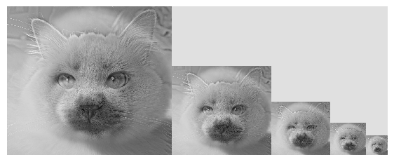
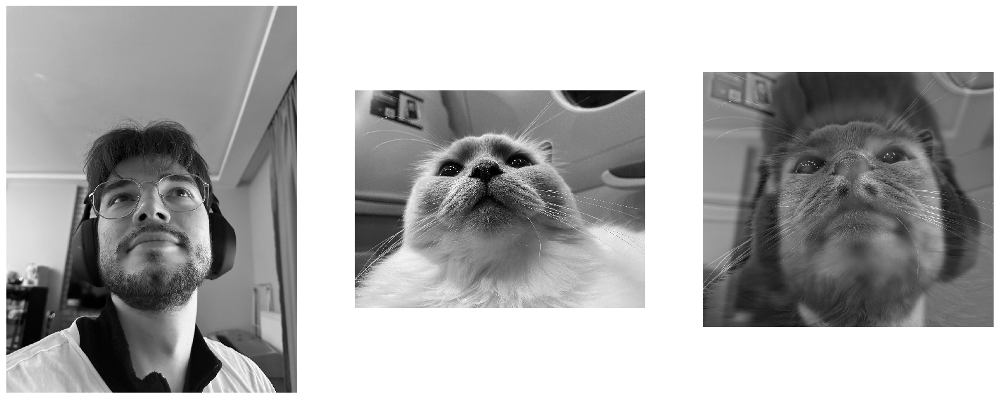
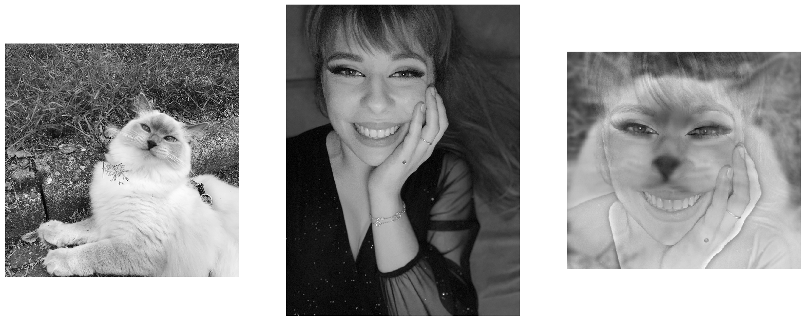
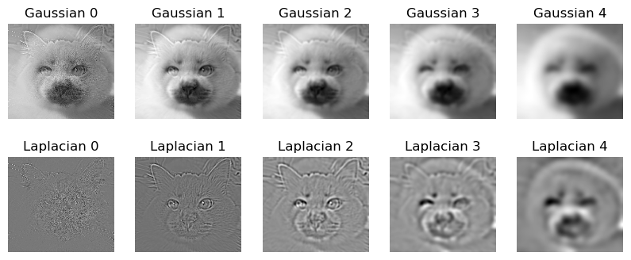
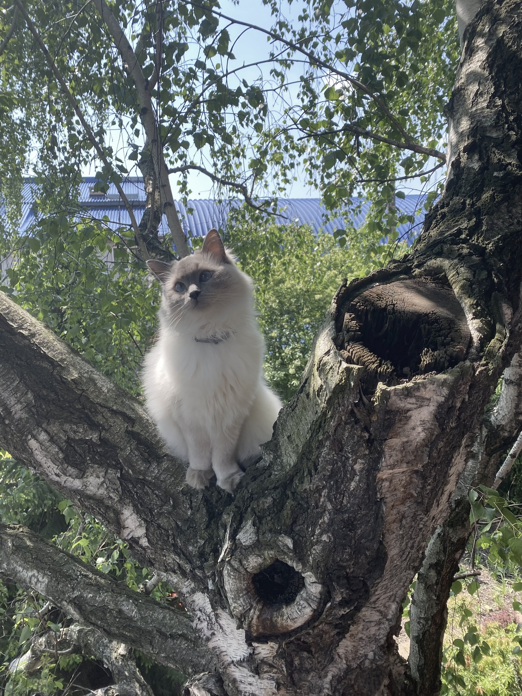
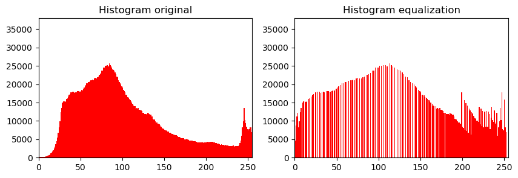

**Full report of the process and results can be found in [AnalysisReport.pdf](https://github.com/OlaPietka/Hybrid-Images/blob/main/AnalysisReport.pdf)**

# Hybrid image

The goal of this project is to create *hybrid image* using the approach
described in [*SIGGRAPH 2006* paper by Oliva, Torralba, and Schyns](https://stanford.edu/class/ee367/reading/OlivaTorralb_Hybrid_Siggraph06.pdf).

## Process 

The steps for creating a hybrid image are as follows:

1.  **Select two similar images**: The first step is to select two
    images with similar content and features, as this makes it easier to
    combine them and produce a convincing hybrid image.

2.  **Align the images**: Resize and rotate the images such that the
    object on first image will be perfectly located on top of the object
    on the other image.

3.  **Filter the images**: Apply a low-pass filter to one image to
    extract the low-frequency content, and a high-pass filter to the
    other image to extract the high-frequency content.

4.  **Experiment with weights**: Experiment with different weights to
    control the relative dominance of the low-pass and high-pass filter.

5.  **Combine the filtered images**: Combine the filtered images by
    adding them, to produce the final hybrid image.

## Final results 

The final result of a hybrid image is a composite image that merges the
low-frequency content from one image with the high-frequency content
from another image. The low-frequency content provides the overall
structure and the dominant features of the image, while the
high-frequency content provides the fine details and sharp edges of the
image.

Final hybrid image            |  Final hybrid image scale
:-------------------------:|:-------------------------:
  |  

### Other examples

## Gaussian/Laplacian pyramid 

The Laplacian pyramid is a sequence of the difference between each level
of the Gaussian pyramid and the upsampled version of the next level. The
Laplacian pyramid represents the high-frequency content of the image,
which corresponds to the fine details and sharp edges in the image. The
Laplacian pyramid provides a multi-scale representation of the image's
high-frequency content, where each level of the pyramid represents a
different scale or level of detail of the image.

# Image enhancement 
The purpose of image enhancement is to improve the visual quality of an
image by adjusting its contrast, brightness, sharpness, and other
attributes. Image enhancement techniques can be used to make an image
clearer, more detailed, and easier to understand.

## Contrast enhancement 
Histogram equalization is often considered a good method for contrast
enhancement because it works by redistributing the intensities of the
pixels in an image such that the resulting histogram is more uniform,
which can result in an image with a higher dynamic range and improved
contrast.

Original image            |  Contrast enhancement
:-------------------------:|:-------------------------:
  |  

## Color enhancement 

For this part I decided to use gamma correction on the S (Saturation)
channel of HSV color space. The gamma correction function is defined by
a single parameter, known as the gamma value, which determines the
degree of the non-linearity. I'm aware that gamma function is not
specifically designed for this purpose, but I'm really happy with how it
turned out so I decided to share my results with you.

Original image            |  Color enhancement
:-------------------------:|:-------------------------:
  |  

## Color shift

Color shifting refers to the process of adjusting the hue of an image. I
decided to mask pixels that correspond to color on the A and B channels
of LAB color space (e.g. \>127 on A channel for red), and use a simple
scalar multiplication to boost or weaken the color. Multiplying by a
value greater than 1 on A channel boosts the red color without changing
green pixels. The same holds for the B channel, multiplying by a value
less than 1 boosts the yellow color without changing blue pixels.

Original image            |  Color shift - more red  | Color shift - less yellow
:-------------------------:|:-------------------------:|:-------------------------:
  |   | 
